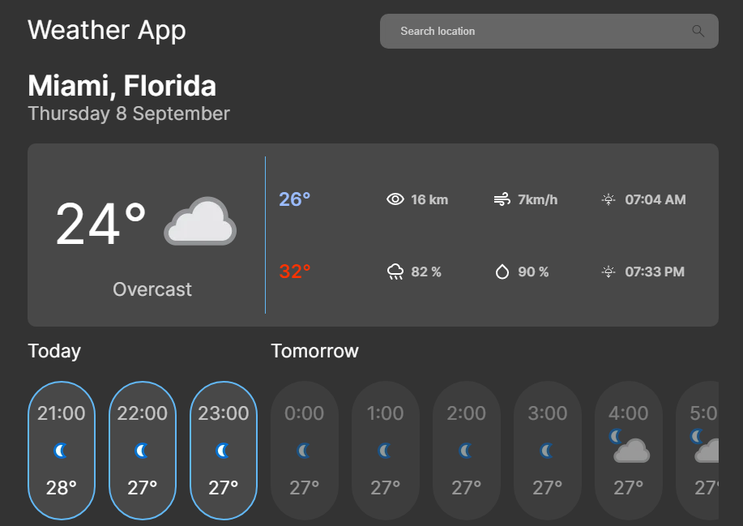

<h1 align="center">Weather app</h1>

## Demo

Accede a la web [Weather-App](https://any-weather.vercel.app/)

## Lista de contenido

- [Descripción](#descripción)
- [Capturas](#capturas)
- [Tecnologías](#tecnologías)
- [Instalacion y Comandos](#instalacion-y-comandos)

## Descripción

<p>Weather-App es una aplicación meteorológica para conocer el clima actual y de los próximos días, además de otros datos como la visibilidad, probabilidad de lluvia, humedad, etc…, del tu localización actual o la que desees buscar.</p>

## Capturas



## Tecnologías

```
-> React.js
-> Hooks
-> Wouter
-> Styled-Components
```

## Instalacion y Comandos

- Descarga o clona el repositorio

- Requisito: [API KEY](https://rapidapi.com/weatherapi/api/weatherapi-com/)

- Instalacion:

`npm install`

- Visita:

`https://localhost:3000/`
